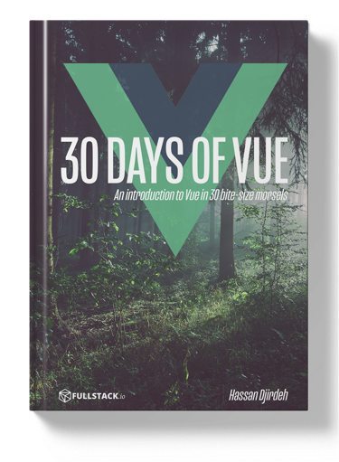
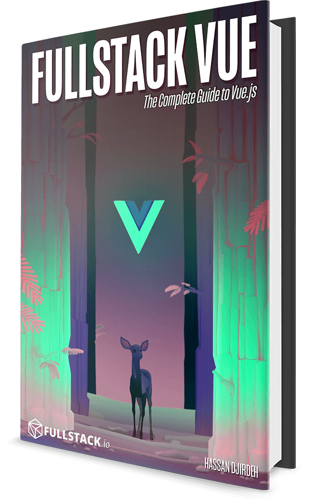

<p align="center">
  
</p>
<h3 align="center">
  ✨ 30 Ngày với Vue ✨
</h3>
<p align="center">
  Giới thiệu về Vue - qua 30 bài học nhỏ gọn. Được viết bởi tác giả của <a href="https://fullstack.io/vue">Fullstack Vue</a>
</p>
<p align="center">
  <a href="https://fullstack.io/30-days-of-vue">
    
  </a>
</p>

# 🚀 Giới thiệu

Trong 30 ngày tới, chúng ta sẽ cùng nhau tìm hiểu mọi thứ bạn cần biết để làm việc với Vue. Từ những kiến thức cơ bản nhất như Vue Instance, Components, cho đến cả Testing.

Kho lưu trữ này chứa toàn bộ mã nguồn và nội dung cho chuỗi bài viết [30 Ngày với Vue](https://www.fullstack.io/30-days-of-vue) được thực hiện bởi nhóm [Fullstack Vue](https://fullstack.io/vue).

## 👀 Có gì bên trong?

<!-- prettier-ignore -->
|  <a align='center' href='./day-01'></a><h4 align='center'><a href='./day-01'>Vue là gì?</a><h4> | <a href='./day-02'></a><h4 align='center'><a href='./day-02'>Dữ liệu</a><h4> | <a href='./day-03'></a><h4 align='center'><a href='./day-03'>Ứng dụng hướng dữ liệu</a><h4> | <a href='./day-04'></a><h4 align='center'><a href='./day-04'>Chỉ thị Vue</a><h4> | <a href='./day-05'></a><h4 align='center'><a href='./day-05'>Hiển thị danh sách</a><h4>  |
|:-:|:-:|---|---|---|
|  <a href='./day-06'></a><h4 align='center'><a href='./day-06'>Xử lý Form</a><h4> | <a href='./day-07'></a><h4 align='center'><a href='./day-07'>Vue Devtools</a><h4>  | <a href='./day-08'></a><h4 align='center'><a href='./day-08'>Thuộc tính tính toán</a><h4>  | <a href='./day-09'></a><h4 align='center'><a href='./day-09'>Watchers</a><h4>  | <a href='./day-10'></a><h4 align='center'><a href='./day-10'>Vòng đời</a><h4>  |
|  <a href='./day-11'></a><h4 align='center'><a href='./day-11'>Component toàn cục</a><h4> | <a href='./day-12'></a><h4 align='center'><a href='./day-12'>Props</a><h4> | <a href='./day-13'></a><h4 align='center'><a href='./day-13'>Sự kiện tuỳ chỉnh</a><h4>  | <a href='./day-14'></a><h4 align='center'><a href='./day-14'>Chi tiết Component</a><h4>  | <a href='./day-15'></a><h4 align='center'><a href='./day-15'>Định nghĩa Template</a><h4>  |
|  <a href='./day-16'></a><h4 align='center'><a href='./day-16'>Render Functions</a><h4> | <a href='./day-17'></a><h4 align='center'><a href='./day-17'>Component file đơn</a><h4>  | <a href='./day-18'></a><h4 align='center'><a href='./day-18'>Vue CLI</a><h4>  | <a href='./day-19'></a><h4 align='center'><a href='./day-19'>EventBus</a><h4>  | <a href='./day-20'></a><h4 align='center'><a href='./day-20'>Global Store đơn giản</a><h4>  |
|  <a href='./day-21'></a><h4 align='center'><a href='./day-21'>Giới thiệu Flux</a><h4> | <a href='./day-22'></a><h4 align='center'><a href='./day-22'>Vuex</a><h4>  | <a href='./day-23'></a><h4 align='center'><a href='./day-23'>Giới thiệu Routing</a><h4>  | <a href='./day-24'></a><h4 align='center'><a href='./day-24'>Vue Router</a><h4>  | <a href='./day-25'></a><h4 align='center'><a href='./day-25'>Giới thiệu Testing</a><h4>  |
|  <a href='./day-26'></a><h4 align='center'><a href='./day-26'>Triển khai Test</a><h4> | <a href='./day-27'></a><h4 align='center'><a href='./day-27'>Test ứng dụng</a><h4> | <a href='./day-28'></a><h4 align='center'><a href='./day-28'>Vue Test Utils</a><h4>  | <a href='./day-29'></a><h4 align='center'><a href='./day-29'>Vue 3.0</a><h4>  | <a href='./day-30'></a><h4 align='center'><a href='./day-30'>Tổng kết</a><h4>  |

## 👩‍🏫 Cách sử dụng kho lưu trữ này

Mỗi ngày sẽ chứa một ứng dụng Vue hoàn chỉnh hoặc các đoạn mã xây dựng lên ứng dụng, theo đúng trình tự của chuỗi bài viết. Hầu hết các ngày đều có thể chạy theo các bước cơ bản sau (với những ngày cần thêm thao tác, hãy xem hướng dẫn chi tiết trên blog).

Các bước để chạy ứng dụng Vue độc lập:

```bash
Mở file `index.html` bằng trình duyệt bạn yêu thích.
```

Các bước để chạy ứng dụng Vue sử dụng Webpack:

```bash
# cài đặt các phụ thuộc
yarn install

# chạy dự án
yarn serve
```

## Người đóng góp

<!-- ALL-CONTRIBUTORS-LIST:START - Do not remove or modify this section -->
<!-- prettier-ignore -->
| <a href='https://twitter.com/djirdehh'><h4 align='center'><a href='https://twitter.com/djirdehh'>Hassan Djirdeh</a></h4> | <a href='https://newline.co'><h4 align='center'><a href='https://newline.co'>Nate Murray</a></h4> |
| :---: | :---: |

<!-- ALL-CONTRIBUTORS-LIST:END -->

# Sách Fullstack Vue

<a href="https://fullstack.io/vue">
  
</a>

Kho lưu trữ này được viết và duy trì bởi nhóm [Fullstack Vue](https://fullstack.io/vue). Trong cuốn sách, chúng tôi trình bày nhiều dự án thực tế hơn nữa. Chúng tôi đi qua từng dòng mã, giải thích lý do và cách hoạt động của nó.

_30 Ngày với Vue_ chỉ bao gồm những kiến thức cơ bản ban đầu về Vue. Nếu bạn muốn học cách xây dựng ứng dụng Vue thực tế, bao gồm cả các thư viện trong hệ sinh thái Vue, không có cách nào nhanh hơn là dành vài giờ với cuốn sách Fullstack Vue.
