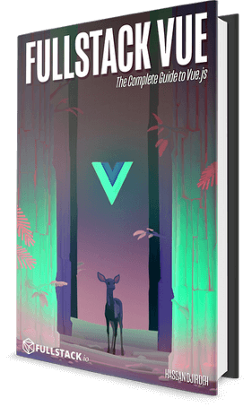

# Kết luận

Bạn đã hoàn thành 30 Days of Vue và muốn tìm hiểu sâu hơn về Vue cùng chúng tôi? Hãy xem qua [Fullstack Vue](https://www.fullstack.io/vue/)! Không chỉ đi sâu vào các chủ đề đã giới thiệu trong 30 ngày này, chúng tôi còn đề cập đến rất nhiều nội dung khác, bao gồm (nhưng không giới hạn):

  

- Các mẫu thiết kế đã được kiểm chứng để xây dựng ứng dụng Vue quy mô lớn từ đầu.
- Tích hợp Vuex vào ứng dụng lưu trữ dữ liệu trên server.
- Routing nâng cao với dynamic route matching, navigation guards, và các route yêu cầu xác thực.
- Phân tích chuyên sâu về unit test, bao gồm kiểm thử component trong môi trường tích hợp Vue Router và Vuex.
- Các biểu mẫu! Chúng tôi hướng dẫn kiểm tra, xác thực form từ cơ bản đến nâng cao, kể cả tích hợp với Vuex.
- Trọn gói – truy cập chuỗi video gần 2 giờ, hướng dẫn thiết lập, xây dựng và triển khai **một ứng dụng Vue.js hoàn chỉnh** từ đầu – [xem thử ứng dụng tại đây](https://www.simplecoincap.com/)!
- Và còn nhiều nội dung hấp dẫn khác.

Tất cả đều được trình bày trong bối cảnh xây dựng **các ứng dụng lớn hơn**. Xem chi tiết tại trang sách [www.fullstack.io/vue](https://www.fullstack.io/vue) để biết thêm thông tin!
