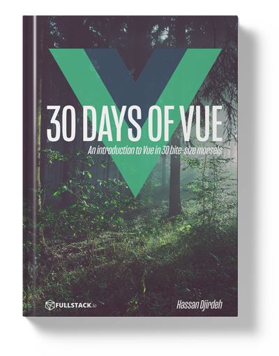

# Giới thiệu

Xin chào!

Chào mừng bạn đến với **30 Days of Vue của Fullstack** – một loạt bài giới thiệu về framework Vue qua 30 bài học nhỏ gọn.

  

Tôi là [Hassan](https://twitter.com/djirdehh), một Kỹ sư Front End sống tại Toronto, Canada. Tôi đã yêu thích Vue từ vài năm trước và dành nhiều thời gian rảnh để [biên soạn các bài blog về nhiều chủ đề](https://medium.com/fullstackio) trong framework này, [thuyết trình](https://www.youtube.com/watch?v=B7g7MOrDtMY), [tổ chức workshop](https://vuetraining.fullstack.io/), và viết cuốn sách [Fullstack Vue](https://www.fullstack.io/vue/).

Nếu bạn chưa từng dùng Vue và muốn bắt đầu, chào mừng bạn! Tôi luôn khuyến khích người mới nên đọc qua [Tài liệu chính thức của Vue](https://vuejs.org/v2/guide/installation.html) vì đây là một trong những tài liệu được viết tốt nhất hiện nay. Trong cộng đồng JavaScript, tôi nhận thấy nhiều tài liệu học tập thường giả định người đọc đã biết trước một số khái niệm. Với 30 Days of Vue, tôi cố gắng làm cho tài liệu này **thân thiện nhất có thể với người mới hoàn toàn**. Chúng ta sẽ giữ mọi thứ _đơn giản_ và minh họa các khái niệm bằng những ví dụ dễ hiểu. Nếu bạn đã quen với HTML, CSS và có chút kiến thức về JavaScript – bạn đã đến đúng nơi!

Trong 30 Days of Vue, chúng ta sẽ cùng nhau tìm hiểu các khái niệm phổ biến trong phát triển web hiện đại (ví dụ: **UI hướng dữ liệu**, **component web tái sử dụng**, kiến trúc **Flux**, dự án dựa trên **Webpack**, v.v.) – tất cả đều trong một trong những framework JavaScript phát triển nhanh nhất hiện nay: Vue.js.

Tôi thực sự hy vọng bạn sẽ thích tài liệu này như tôi đã thích khi biên soạn nó. Tôi sẽ cố gắng cập nhật tài liệu thường xuyên, nên nếu bạn có câu hỏi, góp ý hoặc muốn đóng góp – hãy liên hệ qua [Github Repo](https://github.com/fullstackio/30-days-of-vue). Bạn cũng có thể gửi email cho chúng tôi tại [us@fullstack.io](us@fullstack.io) hoặc nhắn cho tôi trên Twitter – [@djirdehh](https://twitter.com/djirdehh).

Thân ái!
Hassan Djirdeh
